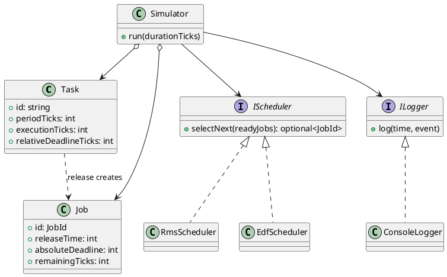

# Architecture

## Scope

TaskSched is a deterministic, single-core simulator for preemptive periodic tasks. Time advances in integer ticks; the simulator does not create OS threads or wait in real time.

At each tick it releases due jobs, reports unfinished jobs whose deadlines have arrived, selects one ready job, and runs it for one tick. A job unfinished at the start of its absolute deadline is a deadline miss.

## Components

```text
Task definitions -> Simulator -> IScheduler -> RMS | EDF
                       |
                       +-> ILogger -> ConsoleLogger
```

- `Task`: periodic workload definition.
- `Job`: a concrete runtime instance released from a task.
- `Simulator`: time advancement, release, execution and deadline checking.
- `IScheduler`: ready-job selection contract.
- `RmsScheduler` and `EdfScheduler`: scheduling policies.
- `ILogger`: event-output contract.

## Extensibility

`Simulator` depends on `IScheduler` and `ILogger`, so scheduling policies and output adapters can be replaced independently. `makeScheduler` centralizes construction of the built-in policies.

## Class diagram


